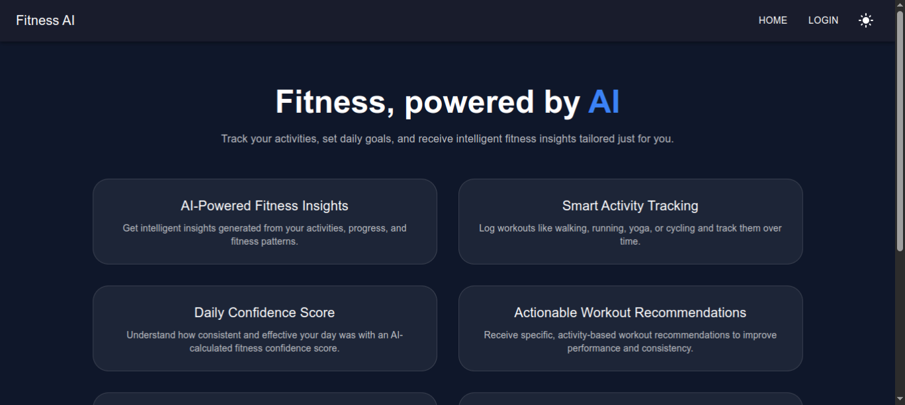
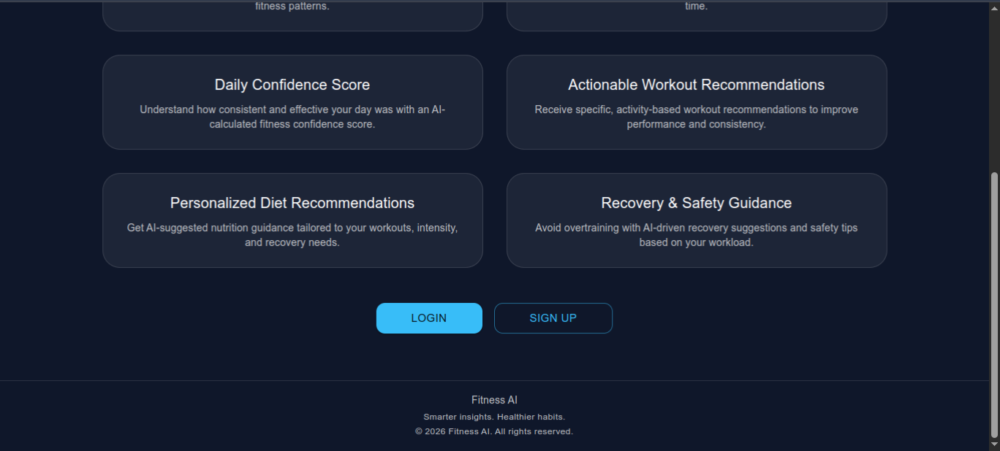
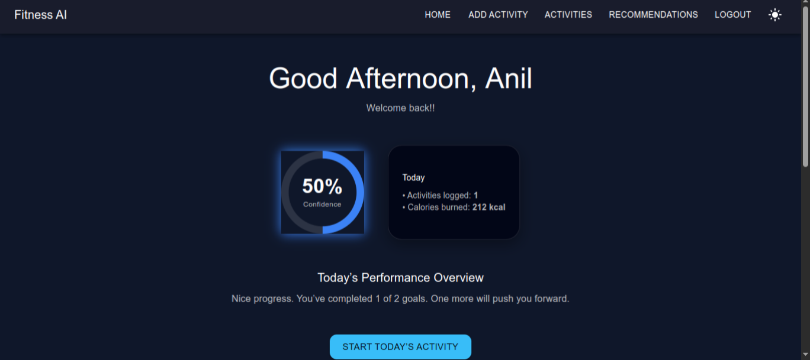
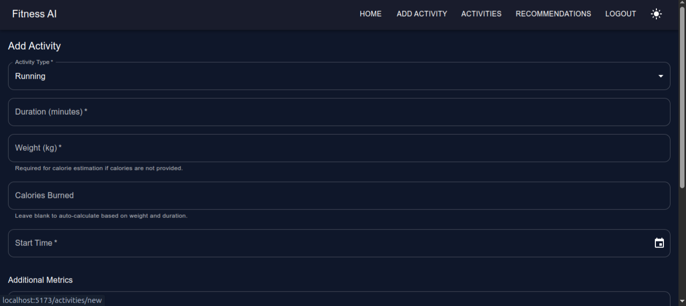
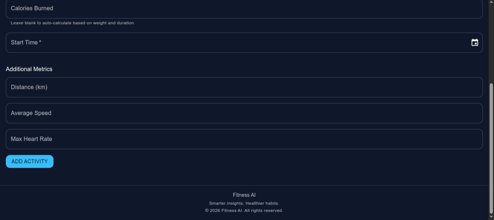
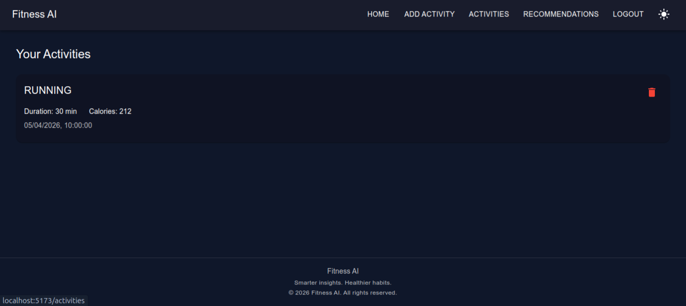
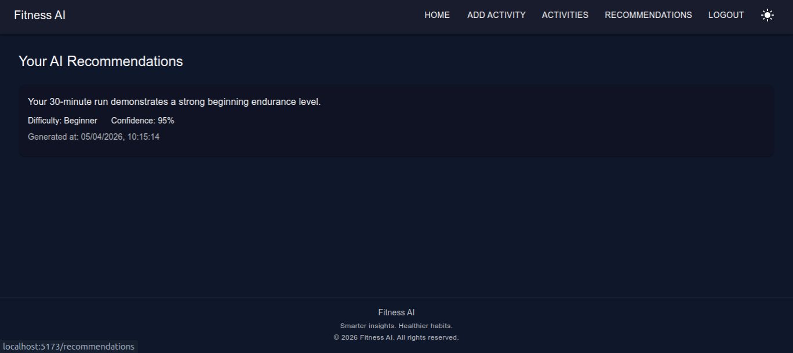
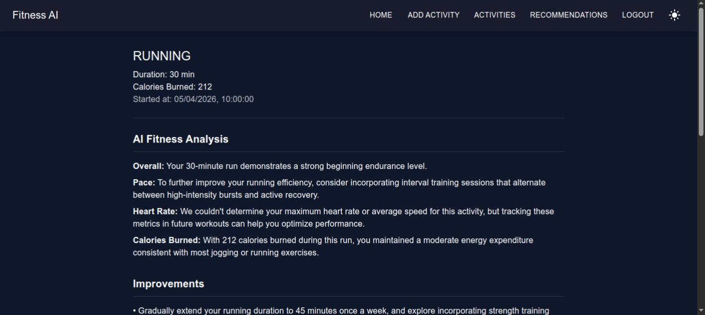
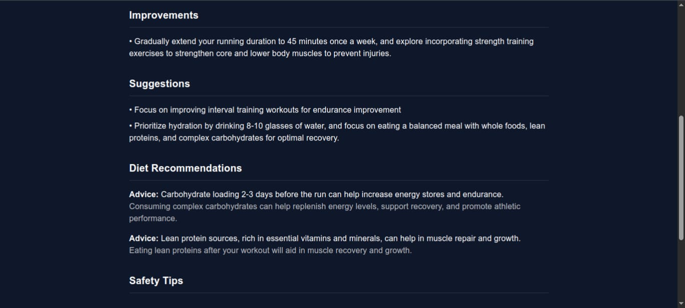
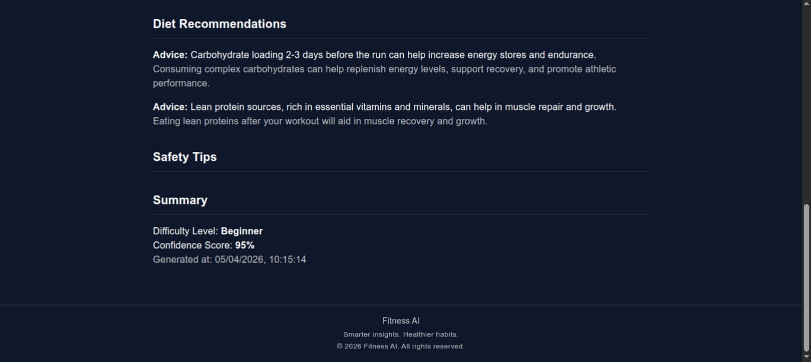

                                            Fitness AI Application

A distributed, production-style fitness tracking platform built using a microservices architecture.

The system enables secure activity tracking, intelligent AI-powered workout insights, and scalable service communication using modern backend and frontend technologies.


Architecture Overview:

The application follows a microservices-based architecture, where each service is independently developed, deployed, and scaled.

Services communicate through:

    * Synchronous REST APIs
        
        - Gateway → Services

        - Activity Service → User Service 

    * Asynchronous messaging (RabbitMQ)

        - Activity Service → RabbitMQ → AI Service

This hybrid communication model ensures modularity, scalability, loose coupling, and fault tolerance.


Microservices Architecture:

1. Eureka Server (Service Discovery)

    * Registers all microservices dynamically

    * Enables service-to-service communication without hardcoded URLs

    * Supports load-balanced inter-service calls

2. Config Server (Centralized Configuration)

    * Manages externalized configuration for all services

    * Centralizes application properties

    * Allows configuration updates without rebuilding services

3. API Gateway

    * Single entry point for all client requests

    * Performs JWT validation

    * Routes requests to appropriate microservices

    * Handles CORS and security filters

4. User Service 

    * Manages user-related structured data

    * Handles daily targets (create, toggle, reset, delete)

    * Calculates confidence score

    * Supports auto-completion of targets

5. Activity Service 

    * Manages workout logging

    * Stores activity details (type, duration, calories, timestamps)

    * Publishes activity events to RabbitMQ

    * Calls User Service for auto-target completion

6. AI Service 

    * Consumes activity events from RabbitMQ

    * Generates AI-powered workout summaries

    * Stores recommendations linked to activity ID


Tech Stack:

    🔹 Backend:

        1. Spring Boot

        2. Spring Security

        3. RESTful Microservices

        4. RabbitMQ

        5. OAuth2 Authorization Code Flow with PKCE

        6. Keycloak

        7. WebClient (Inter-service communication)
    
    🔹 DataBases:

        1. PostgreSQL (Relational Data)

        2. MongoDB (Activity Data)

    🔹 Frontend:

        1. ReactJS

        2. Material UI
    
    🔹 AI Integration:

        1. Groq API (LLM-based activity insights)

    
Authentication & Security:
    
    * OAuth2 Authorization Code Flow with PKCE

    * Centralized identity management using Keycloak

    * JWT-based authentication

    * Token refresh mechanism

    * Protected frontend routes

    * Secure logout handling


Core Features:

    * Secure authentication and authorization using Keycloak (OAuth2 + PKCE)

    * Activity logging with type, duration, calories burned, and timestamp

    * Daily target creation, toggle, reset, and deletion

    * AI-generated personalized workout recommendations

    * Event-driven asynchronous communication using RabbitMQ

    * Microservices-based modular architecture

    * Responsive UI built with React and Material UI


AI Workflow:
    * User logs an activity
    * Activity Service validates user
    * Activity is saved in MongoDB
    * Activity event is published to RabbitMQ 
    * AI Service consumes the event
    * AI Service generates recommendation
    * Recommendation is stored in MongoDB
    * Frontend fetches and displays recommendation

# Screenshots

<p align="center">
  
  <br><i>1. Home Page before Login / Welcome Screen</i><br><br>
  
  
  <br><i>2. continue..</i><br><br>
  
  
  <br><i>3. Home Page after Login</i><br><br>

  
  <br><i>4. Add Activity Page</i><br><br>

  
  <br><i>5. Continue..</i><br><br>

  
  <br><i>6. Activities Page</i><br><br>

  
  <br><i>7. Ai Recommendations Page</i><br><br>

  
  <br><i>8.Recommendation of a Specific Activity</i><br><br>

  
  <br><i>9. Continue..</i><br><br>

  
  <br><i>10. Continue..</i><br><br>
</p>

---

# How to Run

### 1. Prerequisite
Ensure you have the following ready:
- Keycloak Client Secret
- Groq API Key (for AI insights)

### 2. Run with Docker
The entire infrastructure (PostgreSQL, MongoDB, Keycloak, Mailhog, and backend microservices) can be started using Docker Compose from the root directory:
```bash
docker compose up -d --build
```

### 3. Key Infrastructure Access
- **API Gateway (Central Entry)**: [http://localhost:8080](http://localhost:8080)
- **Frontend App**: [http://localhost:5173](http://localhost:5173)
- **Keycloak Admin Console**: [http://localhost:8081/admin](http://localhost:8081/admin) (admin/admin)
- **Mailhog Dashboard (Email Testing)**: [http://localhost:8025](http://localhost:8025)

---

# New Features & Enhancements

### Hybrid Calorie Calculation
The platform now supports automated calorie estimation based on the **MET (Metabolic Equivalent of Task)** formula:
- **Formula**: `Calories = MET × weight (kg) × (duration / 60)`
- **Manual Override**: Users can still provide their own calorie burn data manually.
- **Auto-Calculation**: If the calorie field is left blank, the system estimates the burn based on activity type, user weight, and duration.

### Persistence & Email Testing
- **Data Persistence**: All service databases and Keycloak configurations are stored in named Docker volumes (`postgres-data`, `mongo-data`, `keycloak-data`), ensuring data survives container restarts.
- **Local Mail Testing**: Integrated **Mailhog** allows for testing user registration and email verification flows without needing a real SMTP server. All outgoing "user verification" emails can be viewed in the Mailhog dashboard at [http://localhost:8025](http://localhost:8025).


    
